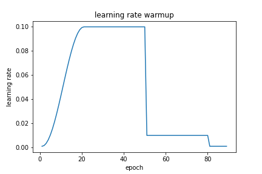

# Paddlepaddle Scheduler wrapper support learning rate warmup

This repo is inspired by [torch-warmup-lr](https://github.com/lehduong/torch-warmup-lr).

A wrapper around the Paddlepaddle learning rate scheduler for warming up learning rate. The wrapper allows to specify the following:
* Standard interface
* Access to LRScheduler  object's attributes 
* Different strategies for warming up learning rate
* Load and save state dict



### Installation
```
pip install git+git://github.com/DrRyanHuang/paddle-warmup-lr
```

如果你网速不太行，可以使用github加速通道: [https://github.91chi.fun](https://github.91chi.fun)
```
pip install git+https://github.91chi.fun/https://github.com/DrRyanHuang/paddle-warmup-lr.git
```


### Usage
Simple add a wrapper after constructing `paddle.optimizer.lr.LRScheduler` object:

```python
lr_base = 0.1
lr_scheduler = lr.StepDecay(lr_base, step_size=10, gamma=0.1)
lr_scheduler = WarmupLR(lr_scheduler, init_lr=0.01, num_warmup=3, warmup_strategy='cos')
opt = optim.SGD(parameters=model_parmas, learning_rate=lr_scheduler)
```

+ `init_lr`: learning rate will increase from this value to the initialized learning rate in optimizer (in this case 0.01 -> 0.1).
+ `num_warmup`: number of steps for warming up learning rate.
+ `warmup_strategy`: function that learning rate will gradually increase according to. Currently support **cos**, **linear**, **constant** - learning rate will be fixed and equals to *init_lr* during warm-up phase).

### Example
Below is a runnable example of `WarmupLR`:
```python
import paddle
import paddle.optimizer as optim
import paddle.optimizer.lr as lr
import pandas as pd
import seaborn as sns
from paddle_warmup_lr import WarmupLR

# StepDecay, MultiStepDecay, ExponentialDecay, ReduceOnPlateau

if __name__ == '__main__':
    
    model_parma  = paddle.randn([1, 1], dtype="float32")
    model_parma  = paddle.create_parameter(
        shape=model_parma.shape,
        dtype=str(model_parma.dtype).split(".")[1],
        default_initializer=paddle.nn.initializer.Assign(model_parma)
    )
    lr_base = 0.1
    model_parmas = [model_parma]

    # Choose different scheduler to test
    lr_scheduler = lr.StepDecay(lr_base, step_size=10, gamma=0.1)
    # lr_scheduler = lr.MultiStepDecay(lr_base, milestones=[3,6,9], gamma=0.1)
    # lr_scheduler = lr.ReduceOnPlateau(lr_base, threshold=0.99, mode='min', patience=2, cooldown=5)
    lr_scheduler = WarmupLR(lr_scheduler, init_lr=0.01, num_warmup=3, warmup_strategy='cos')


    opt = optim.SGD(parameters=model_parmas, 
                    learning_rate=lr_scheduler)
    

    # this zero gradient update is needed to avoid a warning message, issue #8.
    opt.clear_gradients()
    opt.step()
    
    
    # The wrapper doesn't affect old scheduler api
    # Simply plug and play
    for epoch in range(1, 20):
        # step with pseudo loss if we're using reducelronplateau
        if isinstance(lr_scheduler._scheduler, lr.ReduceOnPlateau):
            pseudo_loss = 20-epoch
            lr_scheduler.step(pseudo_loss)
            print('Epoch: {} LR: {:.3f} pseudo loss: {:.2f}'.format(epoch, 
                                                                    opt.get_lr(), 
                                                                    pseudo_loss))
        # step without any parameters
        else:
            lr_scheduler.step()
            print(epoch, opt.get_lr())
        opt.step()    # backward pass (update network)
    
    # get scheduler attribute
    print(lr_scheduler.state_dict()['wrapper'])
    print(lr_scheduler.state_dict()['wrapped'])
```
